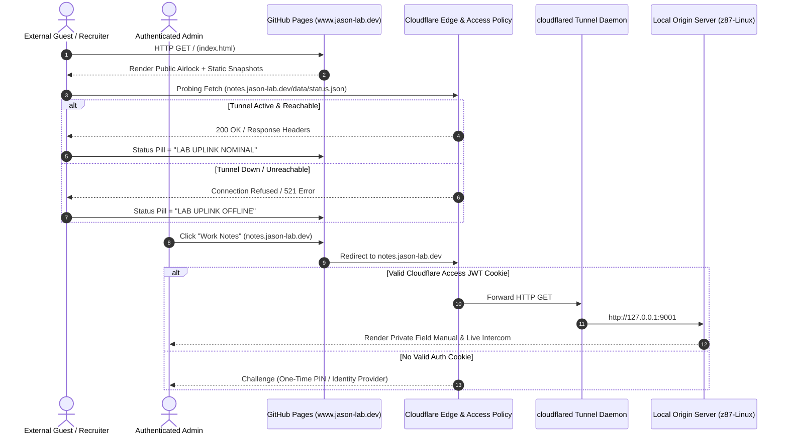

# 🌐 Acme Lab Public Airlock (`www.jason-lab.dev`)

> High-density architecture specification and setup guide for a hybrid public/private Zero Trust web infrastructure.


---

## 🚀 Setup & Replication Guide (Tutorial)

Follow these steps to replicate this hybrid public/private Zero Trust architecture:

### Step 1: GitHub Pages Setup
1. Create a public repository named `username.github.io` (e.g. `kEnder242.github.io`).
2. Add your sanitized `index.html` and static assets.
3. In Repository **Settings > Pages**, set **Source** to `Deploy from a branch` (`main` / root).
4. Add custom domain (e.g. `www.jason-lab.dev`). GitHub auto-creates a `CNAME` file.

### Step 2: Cloudflare DNS Configuration
1. Point domain DNS to Cloudflare nameservers.
2. Add **CNAME** record:
   - `Type`: `CNAME`
   - `Name`: `www`
   - `Target`: `username.github.io`
   - `Proxy Status`: **Proxied (Orange Cloud)** 🟠

### Step 3: Cloudflare Zero Trust Tunnel (`cloudflared`)
1. On local host (e.g., Z87-Linux), install `cloudflared`:
   ```bash
   sudo cloudflared service install <tunnel-token>
   ```
2. In Cloudflare Zero Trust Dashboard > **Access > Tunnels**:
   - Route `notes.yourdomain.com` -> `http://localhost:9001`
   - Route `acme.yourdomain.com` -> `http://localhost:8765`

### Step 4: Split Access Policy Configuration
1. In Cloudflare Zero Trust > **Access > Applications**:
   - **App 1: Public Airlock (`www`)**: No Access policies (Public).
   - **App 2: Private Notes (`notes`)**: Policy = `Allow` email domain or specific emails via One-Time PIN (OTP).
   - **App 3: Status Probe (`notes/data/status.json`)**: Policy = `Bypass` / `Allow Everyone` for non-sensitive status pings.


---


## 🏛️ jason-lab.dev Summary & Topology

This repository (`kEnder242.github.io`) serves as the **Public Airlock** for the Acme Lab environment. It provides a 100% uptime, zero-attack-surface front door hosted on GitHub Pages, presenting sanitized public work stories, lab protocols, and research ledgers. High-security assets (raw daily notes, vector artifact indexes, live GPU telemetry, and AI Intercom) reside behind a **Cloudflare Zero Trust Access Tunnel** on internal hardware.

### 🌐 System Topology

| Endpoint | Hosting Infrastructure | Security / Access Model | Description / Function |
| :--- | :--- | :--- | :--- |
| **`www.jason-lab.dev`** | GitHub Pages (`kEnder242.github.io`) | 🌍 **Public (Zero Auth)** | **The Airlock.** Static HTML/CSS welcome portal. Public research, protocols, and stories. |
| **`notes.jason-lab.dev`** | Z87-Linux (`http.server 9001`) | 🔐 **Auth (Cloudflare Access)** | **The Portfolio.** 18-year tactical log archive, search index, and artifact map. |
| **`acme.jason-lab.dev`** | Z87-Linux (`acme_lab.py 8765`) | 🔐 **Auth (Zero Trust WSS)** | **The API.** Secure WebSocket bridge for the resident LLM nodes (Pinky/Brain). |

---

## 📐 Architecture Diagram



---

## 📜 Repository Structure

```
www_deploy/
├── index.html            # Public Airlock Homepage & Origin Status Probe
├── protocols.html        # Sanitized Public Operational Protocols
├── research.html         # Sanitized Public Research Ledger
├── stories.html          # Sanitized Public Work Stories & Engineering History
├── sync_protocols.sh     # Airlock Sanitizer & Snapshot Generator for protocols.html
├── sync_research.sh      # Airlock Sanitizer & Snapshot Generator for research.html
├── sync_stories.sh       # Airlock Sanitizer & Snapshot Generator for stories.html
├── assets/               # High-fidelity static trailers & page snapshots
│   ├── protocols_snapshot.png
│   ├── research_snapshot.png
│   └── trailers/
└── CNAME                 # Custom domain configuration (www.jason-lab.dev)

(Portfolio_Dev/field_notes/build_site.py)
```


---

## ⚙️ Static Synthesis Deployment Pipeline

Public pages are automatically synthesized from internal Markdown notes in the private repository, sanitized to strip private tags, and published to GitHub Pages via a single master script.

> [!IMPORTANT]
> **Master Builder Script:** [`Portfolio_Dev/field_notes/build_site.py`](https://github.com/kEnder242/Dev_Lab/blob/main/Portfolio_Dev/field_notes/build_site.py)
>
> The compilation engine resides inside the private repository (`Portfolio_Dev`) so it has full access to raw notes and build tools while outputting clean static assets directly to `www_deploy`.

### Pipeline Data Flow

```
┌──────────────────────────────────────────┐
│ Private Notes & Specifications           │
│  - HomeLabAI/docs/Protocols.md           │
│  - Portfolio_Dev/FeatureTracker.md       │
└────────────────────┬─────────────────────┘
                     │
                     ▼
┌──────────────────────────────────────────┐
│ Master Compiler Script                   │
│  - Portfolio_Dev/field_notes/build_site.py│ ──► Compiles Markdown -> HTML & injects ?v=md5
└────────────────────┬─────────────────────┘
                     │
                     ▼
┌──────────────────────────────────────────┐
│ Airlock Guard Scripts                    │
│  - www_deploy/sync_protocols.sh          │ ──► 1. Strips <mission-control> & data-scope="private"
│  - www_deploy/sync_stories.sh            │     2. Injects "← Return to Front Page"
│  - www_deploy/sync_research.sh           │     3. Captures static trailers (shot-scraper)
└────────────────────┬─────────────────────┘
                     │
                     ▼
┌──────────────────────────────────────────┐
│ Public Airlock Repository                │
│  - www_deploy (kEnder242.github.io)      │ ──► Atomic git push to GitHub Pages
└──────────────────────────────────────────┘
```

### Build & Deploy Execution Commands

```bash
# 1. Run Master Builder (Compiles HTML, hashes assets, runs airlock sanitizers)
python3 Portfolio_Dev/field_notes/build_site.py

# 2. Deploy sanitized release to GitHub Pages
cd www_deploy && git add . && git commit -m "build(airlock): deploy static release"
```


---

## 🔒 The "Knock" Protocol (Cloudflare Zero Trust Access Setup)

The **"Knock" Protocol** defines the Zero Trust access control model protecting the private home lab infrastructure (`notes.jason-lab.dev` and `acme.jason-lab.dev`). Like a secure door knock, visitors crossing the public Airlock boundary must present valid credentials before Cloudflare forwards traffic through the `cloudflared` tunnel.

### 🛡️ Cloudflare Access Configuration (Step-by-Step)

#### 1. Zero Trust Application Setup
In **Cloudflare Zero Trust Dashboard > Access > Applications**:
1. Add a **Self-Hosted Application**.
2. Set **Application Name**: `Acme Lab Private Portfolio`.
3. Set **Application Domain**: `notes.jason-lab.dev`.
4. Set **Session Duration**: `24 Hours` (or custom pin duration).

#### 2. Access Policy & Identity Rules
Define split Access policies governing who is allowed past the gate:

| Policy Name | Action | Rule Criteria | Purpose |
| :--- | :--- | :--- | :--- |
| **`Admin Vault`** | `Allow` | `Emails = admin@jason-lab.dev` | Full access to internal notes, vector search, and LLM Intercom. |
| **`Guest Lobby`** | `Allow` | `Email Domain = panasonic.aero` / Specific Guests | Restrict access to designated recruiters or engineering partners. |
| **`Status Bypass`** | `Bypass` | `Path = /data/status.json` | Unauthenticated origin probe for the Airlock status pill. |

#### 3. Identity Provider (One-Time PIN / OTP)
- Enable **One-Time PIN (OTP)** under **Access > Authentication > Identity Providers**.
- When an unauthenticated user clicks a link to `notes.jason-lab.dev`, Cloudflare Access intercepts the request and emails a 6-digit OTP code.
- Upon successful authentication, Cloudflare sets a secure JWT cookie (`CF_Authorization`) scoped to `.jason-lab.dev`.

#### 4. Pre-Flight Status Probing (`index.html`)
To display real-time lab availability on the public airlock without forcing visitors to log in immediately:

```javascript
const TARGET_URL = 'https://notes.jason-lab.dev/data/status.json';

async function checkStatus() {
    try {
        // mode: 'no-cors' allows opaque status probing across domains
        const r = await fetch(TARGET_URL, { mode: 'no-cors' });
        document.getElementById('statusDot').className = 'dot online';
        document.getElementById('statusText').innerText = 'LAB UPLINK NOMINAL';
    } catch (error) {
        document.getElementById('statusDot').className = 'dot offline';
        document.getElementById('statusText').innerText = 'LAB UPLINK OFFLINE';
    }
}
```


